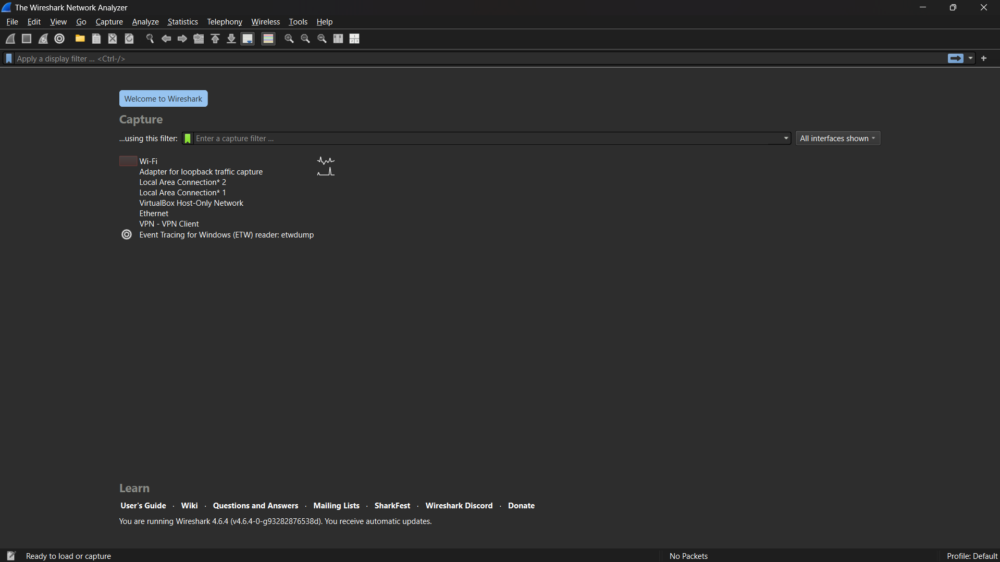

# Laporan praktikun 2 - 12, Maret 2026
Nama        : Rui Juniarta  
Nim         : 103072400090
Kelas       : IF-04-05  
Mata Kuliah : Jaringan Komputer  
  
  
-Tujuan Praktikum
Modul 3 bertujuan agar mahasiswa mampu menganalisis dan memahami mekanisme kerja protokol HTTP menggunakan aplikasi Wireshark.
Langkah-langkah Praktikum Modul 3
1. Persiapan Awal
Jalankan aplikasi Wireshark.
Pada menu capture, pilih interface WiFi, kemudian proses capture akan berjalan secara otomatis.

3. Percobaan 1: HTTP GET dan Response Dasar

Buka browser, lalu akses:

http://gaia.cs.umass.edu/wireshark-labs/HTTP-wireshark-file1.html
Kembali ke Wireshark, masukkan filter http pada kolom pencarian, lalu tekan Enter.
Temukan paket dengan keterangan 200 OK (text/html).
Amati bagian Hypertext Transfer Protocol serta Line-based text data untuk melihat isi respon server.

3. Percobaan 2: HTTP Conditional GET

Buka browser dan akses:

http://gaia.cs.umass.edu/wireshark-labs/HTTP-wireshark-file2.html
Terapkan kembali filter http di Wireshark.
Cari paket dengan status 200 OK (text/html) dan perhatikan detail datanya seperti pada percobaan sebelumnya.

4. Percobaan 3: Pengambilan Dokumen Berukuran Besar
Akses halaman berikut melalui browser:
http://gaia.cs.umass.edu/wireshark-labs/HTTP-wireshark-file3.html
Gunakan filter http di Wireshark.
Identifikasi paket dengan status 200 OK, kemudian analisis isi datanya untuk melihat bagaimana HTTP menangani dokumen besar.

5. Percobaan 4: Dokumen HTML dengan Embedded Object
Buka:
http://gaia.cs.umass.edu/wireshark-labs/HTTP-wireshark-file4.html
Kembali ke Wireshark dan gunakan filter http.
Perhatikan beberapa request/response yang muncul, terutama yang berkaitan dengan objek tambahan (seperti gambar atau file lain).

6. Percobaan 5: HTTP Authentication
Buka halaman berikut:
http://gaia.cs.umass.edu/wireshark-labs/protected_pages/HTTP-wireshark-file5.html
a. Skenario Login Gagal
Masukkan username dan password yang salah, lalu klik Sign In.
Perhatikan bahwa sistem akan meminta autentikasi ulang.
Di Wireshark, gunakan filter http dan amati respon yang diberikan server.
b. Skenario Login Berhasil
Masukkan kredensial berikut:
Username: wireshark-students
Password: network
Klik Sign In hingga berhasil masuk.
Analisis kembali paket HTTP pada Wireshark dan perhatikan perbedaan respon dibandingkan saat gagal login.

7. Mengakhiri Praktikum
Hentikan proses capture dengan menekan tombol Stop (ikon kotak merah).
Tutup aplikasi Wireshark.
Pilih opsi Quit without Saving untuk keluar tanpa menyimpan hasil capture.
